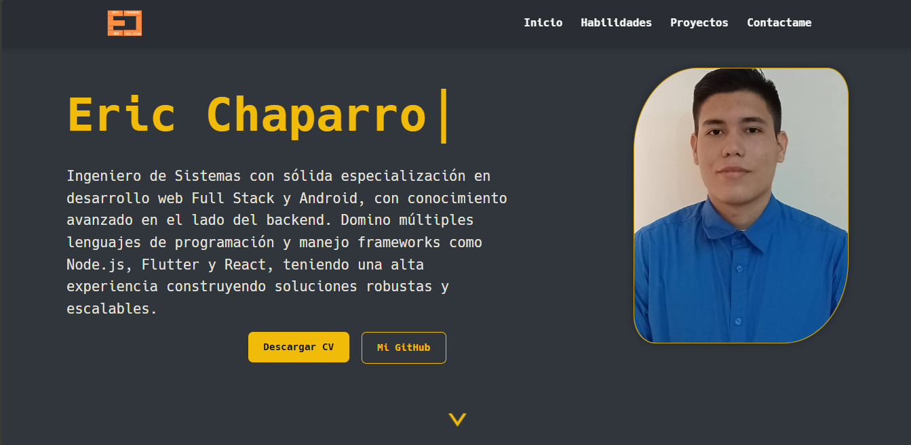

# Eric Chaparro - Portafolio Profesional

<div align="center">
  <h1>👨‍💻 Eric Chaparro | Portafolio Profesional</h1>
  <p>Bienvenido a mi portafolio. Aquí muestro mis habilidades, experiencia y proyectos destacados como desarrollador.</p>
</div>

---

## 🛠️ Tecnologías principales

- <strong>React</strong> + <strong>Vite</strong> (SPA moderna y rápida)
- <strong>CSS Modules</strong> (estilos organizados por sección)
- <strong>Hack Nerd Font</strong> (branding personalizado)
- <strong>SVG Icons</strong> (tecnologías y herramientas)
- <strong>Responsive Design</strong> (adaptable a cualquier dispositivo)

## 📂 Estructura del proyecto

```
Eric_Portafolios/
├── src/
│   ├── assets/         # Imágenes, íconos, fuentes, PDF
│   ├── components/     # Componentes reutilizables
│   ├── sections/       # Secciones principales (Home, About, Projects, Footer)
│   ├── styles/         # CSS por sección y componente
│   └── utils/          # Utilidades
├── index.html
├── package.json
├── vite.config.js
├── README.md
└── eslint.config.js
```

## 🖼️ Vista previa



## 📌 Funcionalidades

- Presentación personal y profesional
- Sección de habilidades y tecnologías
- Proyectos destacados con detalles y enlaces
- Animaciones y componentes interactivos
- Diseño moderno y adaptable

## 📄 CV

Descarga mi CV en PDF desde la sección principal del portafolio o directamente aquí:
[Descargar CV](public/ERIC_CHAPARRO_CV.pdf)

## 🌐 Demo

Prueba el portafolio en vivo:
[Ver Demo](https://portafolios-ericchaparro.vercel.app/) 

## 📫 Contacto

¿Te gustaría trabajar conmigo o tienes alguna consulta?
Puedes contactarme a través del portafolio o por correo:
**ericchaparro1409@gmail.com** 

---

> Este portafolio está construido con pasión y dedicación. ¡Gracias por visitar mi perfil!
